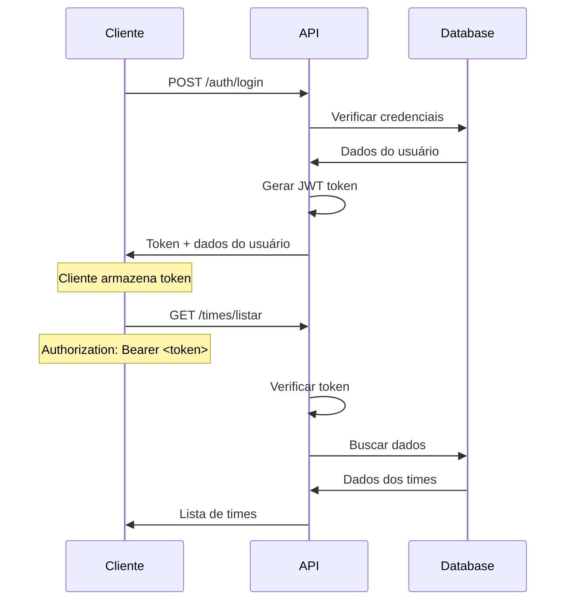

# 🔧 API Technical Documentation - Passa Bola

## 📋 Índice

1. [Visão Geral da API](#-visão-geral-da-api)
2. [Autenticação e Autorização](#-autenticação-e-autorização)
3. [Modelos de Dados](#-modelos-de-dados)
4. [Endpoints Detalhados](#-endpoints-detalhados)
5. [Códigos de Erro](#-códigos-de-erro)
6. [Validações](#-validações)
7. [Middleware](#-middleware)
8. [Exemplos de Uso](#-exemplos-de-uso)

---

## 🌐 Visão Geral da API

### **Base URL**
```
http://localhost:3000/api
```

### **Formato de Resposta**
Todas as respostas são em JSON com a seguinte estrutura:

```json
{
  "msg": "Mensagem descritiva",
  "data": {}, // Dados específicos (opcional)
  "error": "Detalhes do erro" // Apenas em caso de erro
}
```

### **Headers Padrão**
```http
Content-Type: application/json
Authorization: Bearer <token> // Para rotas protegidas
```

---

## 🔐 Autenticação e Autorização

### **Tipos de Token**

#### **1. Token de Usuário (Admin)**
```javascript
{
  "id": "user_id",
  "type": "user"
}
```

#### **2. Token de Jogadora**
```javascript
{
  "id": "jogadora_id", 
  "type": "jogadora"
}
```

### **Fluxo de Autenticação**



### **Middleware de Autenticação**

#### **verificarToken**
- Verifica se o token é válido
- Extrai informações do usuário
- Define `req.userId` ou `req.jogadoraId`

#### **verificarAdmin**
- Verifica se o usuário é admin
- Requer `req.userType === 'user'`
- Verifica `user.isAdmin === true`

#### **verificarJogadora**
- Verifica se é uma jogadora
- Requer `req.userType === 'jogadora'`
- Verifica se a jogadora está aprovada

---

## 📊 Modelos de Dados

### **User (Usuário/Admin)**

```javascript
{
  "_id": ObjectId,
  "name": String,           // Nome do usuário
  "email": String,          // Email único
  "senha": String,          // Hash da senha
  "isAdmin": Boolean,       // Se é administrador
  "createdAt": Date,        // Data de criação
  "updatedAt": Date         // Data de atualização
}
```

**Validações:**
- `name`: Obrigatório, string
- `email`: Obrigatório, único, formato email
- `senha`: Obrigatório, mínimo 6 caracteres
- `isAdmin`: Boolean, padrão false

### **JogadoraCadastrada**

```javascript
{
  "_id": ObjectId,
  "name": String,           // Nome da jogadora
  "lastName": String,       // Sobrenome
  "nacionalidade": String,  // Nacionalidade
  "cpf": String,            // CPF único
  "senhaJogadora": String,  // Hash da senha
  "telefone": String,       // Telefone único
  "dataNascimento": String, // Data de nascimento
  "posicao": String,        // Posição no campo
  "aprovada": Boolean,      // Se está aprovada (padrão: true)
  "time": ObjectId,         // Referência ao time (opcional)
  "createdAt": Date,        // Data de criação
  "updatedAt": Date         // Data de atualização
}
```

**Validações:**
- `name`: Obrigatório, string
- `lastName`: Obrigatório, string
- `cpf`: Obrigatório, único, 11 dígitos
- `telefone`: Obrigatório, único
- `posicao`: Obrigatório, enum: ['Goleira', 'Zagueira', 'Lateral', 'Meio-campo', 'Atacante']

### **Time**

```javascript
{
  "_id": ObjectId,
  "nome": String,           // Nome do time
  "codigoUnico": String,    // Código único (ABC123)
  "grupo": String,          // Grupo (A, B, C, D, E, F, G, H)
  "capacidade": Number,     // Capacidade máxima
  "jogadoras": [ObjectId],  // Array de jogadoras
  "criadoPor": ObjectId,    // ID do admin que criou
  "ativo": Boolean,         // Se o time está ativo
  "createdAt": Date,        // Data de criação
  "updatedAt": Date         // Data de atualização
}
```

**Virtual Fields:**
- `jogadorasAtuais`: Número de jogadoras no time
- `vagasRestantes`: Vagas disponíveis
- `temVaga`: Boolean se tem vaga disponível

**Validações:**
- `nome`: Obrigatório, string
- `codigoUnico`: Obrigatório, único, 6 caracteres
- `grupo`: Obrigatório, enum: ['A', 'B', 'C', 'D', 'E', 'F', 'G', 'H']
- `capacidade`: Obrigatório, número entre 1 e 20

---

## 🛠️ Endpoints Detalhados

### **🔐 Autenticação**

#### **POST /auth/register**
Registra um novo usuário (admin ou comum).

**Request:**
```json
{
  "name": "Administrador",
  "email": "admin@passabola.com",
  "senha": "admin123",
  "isAdmin": true
}
```

**Response (201):**
```json
{
  "msg": "Usuário criado com sucesso!",
  "user": {
    "id": "64f1a2b3c4d5e6f7g8h9i0j1",
    "name": "Administrador",
    "email": "admin@passabola.com",
    "isAdmin": true
  }
}
```

**Validações:**
- Email deve ser único
- Senha mínimo 6 caracteres
- isAdmin é opcional (padrão: false)

#### **POST /auth/login**
Autentica um usuário existente.

**Request:**
```json
{
  "email": "admin@passabola.com",
  "senha": "admin123"
}
```

**Response (200):**
```json
{
  "msg": "Autenticação realizada com sucesso",
  "token": "eyJhbGciOiJIUzI1NiIsInR5cCI6IkpXVCJ9...",
  "user": {
    "id": "64f1a2b3c4d5e6f7g8h9i0j1",
    "name": "Administrador",
    "email": "admin@passabola.com",
    "isAdmin": true
  }
}
```

### **👩‍⚽ Jogadoras**

#### **POST /jogadoras/register**
Registra uma nova jogadora.

**Request:**
```json
{
  "name": "Maria",
  "lastName": "Silva",
  "nacionalidade": "Brasileira",
  "cpf": "12345678901",
  "senhaJogadora": "senha123",
  "telefone": "11999999999",
  "dataNascimento": "1995-05-15",
  "posicao": "Atacante"
}
```

**Response (201):**
```json
{
  "msg": "Jogadora cadastrada com sucesso! Sua conta foi aprovada automaticamente.",
  "jogadora": {
    "id": "64f1a2b3c4d5e6f7g8h9i0j1",
    "name": "Maria",
    "lastName": "Silva",
    "cpf": "12345678901",
    "aprovada": true
  }
}
```

#### **POST /jogadoras/login**
Autentica uma jogadora.

**Request:**
```json
{
  "cpf": "12345678901",
  "senhaJogadora": "senha123"
}
```

**Response (200):**
```json
{
  "msg": "Login realizado com sucesso",
  "token": "eyJhbGciOiJIUzI1NiIsInR5cCI6IkpXVCJ9...",
  "jogadora": {
    "id": "64f1a2b3c4d5e6f7g8h9i0j1",
    "name": "Maria",
    "lastName": "Silva",
    "cpf": "12345678901",
    "posicao": "Atacante",
    "aprovada": true
  }
}
```

#### **GET /jogadoras/listar** (Admin)
Lista jogadoras com filtros.

**Query Parameters:**
- `aprovada`: Boolean (opcional)
- `page`: Number (padrão: 1)
- `limit`: Number (padrão: 10)

**Response (200):**
```json
{
  "jogadoras": [
    {
      "_id": "64f1a2b3c4d5e6f7g8h9i0j1",
      "name": "Maria",
      "lastName": "Silva",
      "cpf": "12345678901",
      "posicao": "Atacante",
      "aprovada": true,
      "time": {
        "_id": "64f1a2b3c4d5e6f7g8h9i0j2",
        "nome": "Time A1"
      }
    }
  ],
  "totalPages": 1,
  "currentPage": 1,
  "total": 1
}
```

### **🏆 Times**

#### **POST /times/criar** (Admin)
Cria múltiplos times.

**Request:**
```json
{
  "quantidade": 8,
  "capacidade": 11
}
```

**Validações:**
- `quantidade`: Deve ser par (4, 8, 16, 32)
- `capacidade`: Entre 1 e 20 (padrão: 11)

**Response (201):**
```json
{
  "msg": "8 times criados com sucesso!",
  "times": [
    {
      "id": "64f1a2b3c4d5e6f7g8h9i0j1",
      "nome": "Time A1",
      "codigoUnico": "ABC123",
      "grupo": "A",
      "capacidade": 11
    }
  ]
}
```

#### **GET /times/listar** (Admin)
Lista todos os times com informações detalhadas.

**Response (200):**
```json
{
  "times": [
    {
      "id": "64f1a2b3c4d5e6f7g8h9i0j1",
      "nome": "Time A1",
      "codigoUnico": "ABC123",
      "grupo": "A",
      "capacidade": 11,
      "jogadorasAtuais": 2,
      "vagasRestantes": 9,
      "temVaga": true,
      "jogadoras": [
        {
          "_id": "64f1a2b3c4d5e6f7g8h9i0j2",
          "name": "Maria",
          "lastName": "Silva",
          "cpf": "12345678901",
          "posicao": "Atacante"
        }
      ],
      "criadoEm": "2024-01-15T10:30:00.000Z"
    }
  ]
}
```

#### **GET /times/buscar/:codigo**
Busca um time pelo código único (público).

**Response (200):**
```json
{
  "time": {
    "id": "64f1a2b3c4d5e6f7g8h9i0j1",
    "nome": "Time A1",
    "codigoUnico": "ABC123",
    "grupo": "A",
    "capacidade": 11,
    "jogadorasAtuais": 2,
    "vagasRestantes": 9,
    "temVaga": true,
    "jogadoras": []
  }
}
```

#### **POST /times/entrar-codigo** (Jogadora)
Jogadora entra em time usando código único.

**Request:**
```json
{
  "codigo": "ABC123"
}
```

**Response (200):**
```json
{
  "msg": "Você foi adicionada ao time com sucesso!",
  "time": {
    "id": "64f1a2b3c4d5e6f7g8h9i0j1",
    "nome": "Time A1",
    "codigoUnico": "ABC123",
    "grupo": "A",
    "capacidade": 11,
    "jogadorasAtuais": 1
  }
}
```

#### **POST /times/entrar-aleatorio** (Jogadora)
Jogadora entra em time aleatório.

**Response (200):**
```json
{
  "msg": "Você foi alocada em um time aleatório com sucesso!",
  "time": {
    "id": "64f1a2b3c4d5e6f7g8h9i0j1",
    "nome": "Time A1",
    "codigoUnico": "ABC123",
    "grupo": "A",
    "capacidade": 11,
    "jogadorasAtuais": 1
  }
}
```

#### **GET /times/meu-status** (Jogadora)
Verifica se a jogadora está em um time.

**Response (200) - Não está em time:**
```json
{
  "emTime": false,
  "msg": "Você não está em nenhum time ainda"
}
```

**Response (200) - Está em time:**
```json
{
  "emTime": true,
  "time": {
    "id": "64f1a2b3c4d5e6f7g8h9i0j1",
    "nome": "Time A1",
    "codigoUnico": "ABC123",
    "grupo": "A",
    "capacidade": 11
  }
}
```

#### **GET /times/estatisticas** (Admin)
Retorna estatísticas do sistema.

**Response (200):**
```json
{
  "estatisticas": {
    "totalTimes": 8,
    "totalJogadoras": 15,
    "timesComVaga": 6,
    "distribuicaoGrupos": [
      {
        "_id": "A",
        "totalTimes": 2,
        "totalJogadoras": 4,
        "capacidadeTotal": 22
      }
    ]
  }
}
```

#### **DELETE /times/deletar-todos** (Admin)
Remove todos os times e limpa referências.

**Response (200):**
```json
{
  "msg": "8 times deletados com sucesso!"
}
```

---

## ❌ Códigos de Erro

### **400 - Bad Request**
Dados inválidos ou regras de negócio violadas.

```json
{
  "msg": "A quantidade de times deve ser um número par (4, 8, 16, 32, etc.)"
}
```

### **401 - Unauthorized**
Token inválido ou ausente.

```json
{
  "msg": "Acesso negado"
}
```

### **403 - Forbidden**
Acesso negado por falta de permissão.

```json
{
  "msg": "Acesso negado. Apenas administradores podem realizar esta ação."
}
```

### **404 - Not Found**
Recurso não encontrado.

```json
{
  "msg": "Código de time inválido"
}
```

### **422 - Unprocessable Entity**
Dados válidos mas não processáveis.

```json
{
  "msg": "Senha inválida!"
}
```

### **500 - Internal Server Error**
Erro interno do servidor.

```json
{
  "msg": "Erro interno do servidor"
}
```

---

## ✅ Validações

### **Validações de Entrada**

#### **Registro de Usuário**
```javascript
{
  name: { required: true, type: 'string', minLength: 2 },
  email: { required: true, type: 'email', unique: true },
  senha: { required: true, type: 'string', minLength: 6 },
  isAdmin: { type: 'boolean', default: false }
}
```

#### **Registro de Jogadora**
```javascript
{
  name: { required: true, type: 'string', minLength: 2 },
  lastName: { required: true, type: 'string', minLength: 2 },
  cpf: { required: true, type: 'string', length: 11, unique: true },
  telefone: { required: true, type: 'string', unique: true },
  posicao: { required: true, enum: ['Goleira', 'Zagueira', 'Lateral', 'Meio-campo', 'Atacante'] }
}
```

#### **Criação de Times**
```javascript
{
  quantidade: { required: true, type: 'number', min: 4, max: 32, even: true },
  capacidade: { type: 'number', min: 1, max: 20, default: 11 }
}
```

### **Validações de Negócio**

#### **Times**
- Quantidade deve ser par
- Não pode criar times se já existem ativos
- Códigos únicos são gerados automaticamente
- Grupos são distribuídos automaticamente

#### **Jogadoras**
- Uma jogadora por time
- Verificação de vagas disponíveis
- Alocação inteligente para times aleatórios

---

## 🔧 Middleware

### **Estrutura do Middleware**

```javascript
const middleware = (req, res, next) => {
  try {
    // Lógica do middleware
    next(); // Continua para o próximo middleware
  } catch (error) {
    res.status(500).json({ msg: "Erro interno do servidor" });
  }
};
```

### **Middleware de Autenticação**

#### **verificarToken**
```javascript
// Verifica token JWT
// Define req.userId ou req.jogadoraId
// Define req.userType ('user' ou 'jogadora')
```

#### **verificarAdmin**
```javascript
// Verifica se é usuário admin
// Requer req.userType === 'user'
// Verifica user.isAdmin === true
```

#### **verificarJogadora**
```javascript
// Verifica se é jogadora aprovada
// Requer req.userType === 'jogadora'
// Verifica jogadora.aprovada === true
```

### **Middleware de Validação**

#### **validateUserRegistration**
```javascript
// Valida dados de registro de usuário
// Verifica campos obrigatórios
// Valida formato de email
```

#### **validateJogadoraRegistration**
```javascript
// Valida dados de registro de jogadora
// Verifica campos obrigatórios
// Valida CPF e telefone
```

---

## 📝 Exemplos de Uso

### **Fluxo Completo - Admin**

```javascript
// 1. Registrar admin
const registerResponse = await fetch('/api/auth/register', {
  method: 'POST',
  headers: { 'Content-Type': 'application/json' },
  body: JSON.stringify({
    name: 'Administrador',
    email: 'admin@passabola.com',
    senha: 'admin123',
    isAdmin: true
  })
});

// 2. Login admin
const loginResponse = await fetch('/api/auth/login', {
  method: 'POST',
  headers: { 'Content-Type': 'application/json' },
  body: JSON.stringify({
    email: 'admin@passabola.com',
    senha: 'admin123'
  })
});

const { token } = await loginResponse.json();

// 3. Criar times
const createTimesResponse = await fetch('/api/times/criar', {
  method: 'POST',
  headers: {
    'Content-Type': 'application/json',
    'Authorization': `Bearer ${token}`
  },
  body: JSON.stringify({
    quantidade: 8,
    capacidade: 11
  })
});
```

### **Fluxo Completo - Jogadora**

```javascript
// 1. Registrar jogadora
const registerResponse = await fetch('/api/jogadoras/register', {
  method: 'POST',
  headers: { 'Content-Type': 'application/json' },
  body: JSON.stringify({
    name: 'Maria',
    lastName: 'Silva',
    nacionalidade: 'Brasileira',
    cpf: '12345678901',
    senhaJogadora: 'senha123',
    telefone: '11999999999',
    dataNascimento: '1995-05-15',
    posicao: 'Atacante'
  })
});

// 2. Login jogadora
const loginResponse = await fetch('/api/jogadoras/login', {
  method: 'POST',
  headers: { 'Content-Type': 'application/json' },
  body: JSON.stringify({
    cpf: '12345678901',
    senhaJogadora: 'senha123'
  })
});

const { token } = await loginResponse.json();

// 3. Verificar status
const statusResponse = await fetch('/api/times/meu-status', {
  headers: { 'Authorization': `Bearer ${token}` }
});

// 4. Entrar em time
const enterTeamResponse = await fetch('/api/times/entrar-codigo', {
  method: 'POST',
  headers: {
    'Content-Type': 'application/json',
    'Authorization': `Bearer ${token}`
  },
  body: JSON.stringify({
    codigo: 'ABC123'
  })
});
```

---

## 🔒 Segurança

### **Autenticação JWT**
- Tokens com expiração de 7 dias
- Secrets diferentes para usuários e jogadoras
- Verificação de tipo de token

### **Criptografia**
- Senhas criptografadas com bcrypt
- Salt rounds: 12
- Hash único para cada senha

### **Validação de Dados**
- Sanitização de entrada
- Validação de tipos
- Verificação de unicidade

### **Autorização**
- Middleware de verificação de permissões
- Controle de acesso baseado em roles
- Verificação de propriedade de recursos

---

**🎯 Esta documentação técnica fornece todas as informações necessárias para integrar e usar a API do Passa Bola! 🚀**
